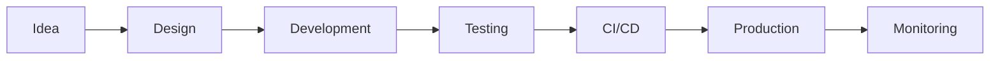

# 🚀 GitHub Profile README — @thangknt99

<div align="center">


<br/>
<br/>

<p>
  
  
  
</p>

</div>

---

# 👋 About Me

```yaml
name: Nguyen Huu Thang
username: thangknt99
role: Backend Developer
location: Vietnam 🇻🇳
focus:
  - Scalable Backend Systems
  - Microservices Architecture
  - REST API / gRPC
  - CI/CD & DevOps
  - Database Optimization
current_stack:
  - .NET
  - PostgreSQL
  - Redis
  - Docker
  - GitHub Actions
learning:
  - Kubernetes
  - Distributed Systems
  - High Performance Architecture
```

---

# ⚡ Tech Stack

## 💻 Languages

<p align="left">
  
</p>

## 🚀 Backend & Frameworks

<p align="left">
  
</p>

## 🗄️ Database & Cache

<p align="left">
  
</p>

## ⚙️ DevOps & Tools

<p align="left">
  
</p>

## 🎨 Frontend

<p align="left">
  
</p>

---

# 📊 GitHub Analytics

<div align="center">


</div>

<div align="center">


</div>

---

# 🏗️ Current Focus

* 🔥 Building scalable backend systems
* ⚡ Optimizing PostgreSQL & Redis performance
* 🚀 Improving CI/CD workflows
* 🧩 Designing clean software architecture
* 📱 API development for mobile & web applications
* ☁️ Exploring Kubernetes & cloud-native technologies

---

# 📌 Featured Projects

## 🎟️ Ticket & Booking System

High-performance booking system with:

* Real-time seat management
* Payment integration
* QR ticket generation
* Inventory & reservation management
* Scalable API architecture

```bash
Tech Stack:
.NET • PostgreSQL • Redis • Docker • CI/CD
```

---

## 💬 Realtime Chat System

Realtime communication platform focused on:

* WebSocket performance
* Optimized message storage
* Scalable architecture
* High concurrent connections

```bash
Tech Stack:
SignalR • Redis • PostgreSQL
```

---

## 📦 Inventory Management Platform

Modern inventory management system:

* Multi-warehouse support
* Realtime stock tracking
* Reporting dashboard
* Mobile responsive UI/UX

```bash
Tech Stack:
.NET • React • PostgreSQL
```

---

# 🧠 Engineering Philosophy

> "Clean architecture, scalable systems, and maintainable code are more valuable than temporary shortcuts."

I enjoy building systems that are:

* Maintainable
* Scalable
* Performant
* Developer-friendly
* Production-ready

---

# 🛠️ Workflow



---

# 🌐 Connect With Me

<p align="left">
  <a href="https://github.com/thangknt99" target="_blank">
    
  </a>

  <a href="https://linkedin.com/in/YOUR_LINKEDIN" target="_blank">
    
  </a>

  <a href="mailto:your-email@gmail.com">
    
  </a>
</p>

---

# ☕ Support

If you like my work and projects, feel free to ⭐ repositories and connect with me.

<div align="center">

### 🚀 "Code. Optimize. Scale. Repeat."

</div>
