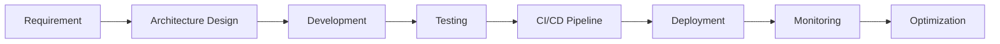

# <div align="center">⚡ THANGKNT99 ⚡</div>

<div align="center">


<br/>


<br/>
<br/>


</div>

---

# 👨‍💻 About Me

```csharp
public class Developer
{
    public string Name => "Nguyen Huu Thang";
    public string Role => "Backend Engineer";
    public string Location => "Vietnam 🇻🇳";

    public string[] Specialties => new[]
    {
        "Scalable System Architecture",
        "Microservices",
        "REST API & gRPC",
        "Database Optimization",
        "CI/CD & DevOps",
        "High Performance Backend"
    };

    public string[] CurrentStack => new[]
    {
        ".NET",
        "PostgreSQL",
        "Redis",
        "Docker",
        "GitHub Actions",
        "Nginx"
    };
}
```

---

# ⚔️ Tech Arsenal

<div align="center">

## 🚀 Backend


## 🗄️ Database


## ⚙️ DevOps & Infrastructure


## 💻 Languages


## 🎨 Frontend


</div>

---

# 📈 GitHub Analytics

<div align="center">


<br/>


</div>

---

# 🏗️ Engineering Focus

<table>
<tr>
<td width="50%">

### 🔥 Backend Development

* High-performance APIs
* Microservices architecture
* Clean architecture
* CQRS pattern
* Authentication & Authorization
* Realtime systems

</td>
<td width="50%">

### ⚡ Performance & DevOps

* PostgreSQL optimization
* Redis caching strategies
* CI/CD automation
* Docker deployment
* Linux server management
* Monitoring & logging

</td>
</tr>
</table>

---

# 🚀 Highlight Projects

## 🎟️ Enterprise Booking Platform

Scalable booking & reservation platform designed for high concurrent traffic.

### Features

* Realtime seat reservation
* QR ticket generation
* Payment integration
* Inventory synchronization
* Distributed caching
* Admin dashboard

```yaml
Architecture:
  - .NET API
  - PostgreSQL
  - Redis Cache
  - Docker Deployment
  - CI/CD Pipeline
```

---

## 💬 Realtime Chat Infrastructure

Realtime communication system optimized for performance.

### Capabilities

* WebSocket communication
* Message queue optimization
* Horizontal scalability
* Presence tracking
* Fast message retrieval

```yaml
Stack:
  - SignalR
  - Redis Pub/Sub
  - PostgreSQL
```

---

## 📦 Smart Inventory Management

Enterprise inventory management with realtime synchronization.

### Includes

* Warehouse management
* Stock synchronization
* Reporting system
* Mobile responsive UI
* Transaction tracking

```yaml
Stack:
  - .NET
  - React
  - PostgreSQL
```

---

# 🧠 Software Engineering Mindset

<div align="center">

> “Good architecture is invisible when everything works perfectly.”

</div>

I focus on building systems that are:

* ✅ Scalable
* ✅ Maintainable
* ✅ Secure
* ✅ Performant
* ✅ Production-ready

---

# 🔄 Development Workflow



---

# 🌐 Connect With Me

<div align="center">

<a href="https://github.com/thangknt99">
  
</a>

<a href="https://linkedin.com">
  
</a>

<a href="mailto:your-email@gmail.com">
  
</a>

</div>

---

<div align="center">

## ⚡ "Build Fast. Scale Smart. Ship Better."

</div>
