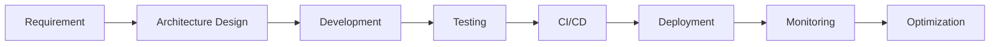

<div align="center">

# ⚡ THANGKNT99 ⚡


<br/>


</div>

---

# 👨‍💻 About Me

Backend Engineer focused on building scalable, maintainable and high-performance systems.

### 🚀 Core Expertise
- Scalable Backend Architecture
- REST API & gRPC
- PostgreSQL Optimization
- Redis Caching
- CI/CD & DevOps
- Microservices Architecture

### ⚡ Current Tech Stack
- .NET / ASP.NET Core
- PostgreSQL
- Redis
- Docker
- GitHub Actions
- Nginx

### 🎯 Interests
- Distributed Systems
- High Performance Applications
- Cloud Native Technologies
- Clean Architecture

---

# ⚔️ Tech Stack

<div align="center">

### 🚀 Backend


### 🗄️ Database


### ⚙️ DevOps & Infrastructure


### 💻 Languages


### 🎨 Frontend


</div>

---

# 📊 GitHub Analytics

<div align="center">


<br/>


</div>

---

# 🏗️ Engineering Focus

<table>
<tr>
<td width="50%">

### 🔥 Backend Development

- High-performance APIs
- Microservices architecture
- Clean architecture
- CQRS pattern
- Authentication & Authorization
- Realtime systems

</td>

<td width="50%">

### ⚡ Performance & DevOps

- PostgreSQL optimization
- Redis caching strategies
- CI/CD automation
- Docker deployment
- Linux server management
- Monitoring & logging

</td>
</tr>
</table>

---

# 🚀 Highlight Projects

## 🎟️ Enterprise Booking Platform

Scalable booking & reservation platform designed for high concurrent traffic.

### Features
- Realtime seat reservation
- QR ticket generation
- Payment integration
- Inventory synchronization
- Distributed caching
- Admin dashboard

### Stack
```yaml
.NET API
PostgreSQL
Redis
Docker
CI/CD
```

---

## 💬 Realtime Chat Infrastructure

Realtime communication system optimized for performance.

### Features
- WebSocket communication
- Horizontal scalability
- Fast message retrieval
- Presence tracking
- Redis Pub/Sub

### Stack
```yaml
SignalR
Redis
PostgreSQL
```

---

## 📦 Smart Inventory Management

Enterprise inventory management with realtime synchronization.

### Features
- Warehouse management
- Stock synchronization
- Reporting dashboard
- Mobile responsive UI
- Transaction tracking

### Stack
```yaml
.NET
React
PostgreSQL
```

---

# 🧠 Engineering Mindset

<div align="center">

> “Good architecture is invisible when everything works perfectly.”

</div>

I focus on building software that is:

- ✅ Scalable
- ✅ Maintainable
- ✅ Secure
- ✅ Performant
- ✅ Production-ready

---

# 🔄 Development Workflow



---

# 🌐 Connect With Me

<div align="center">

<a href="https://github.com/thangknt99">
  
</a>

<a href="https://linkedin.com">
  
</a>

<a href="mailto:your-email@gmail.com">
  
</a>

</div>

---

<div align="center">

## ⚡ Build Fast. Scale Smart. Ship Better.

</div>
